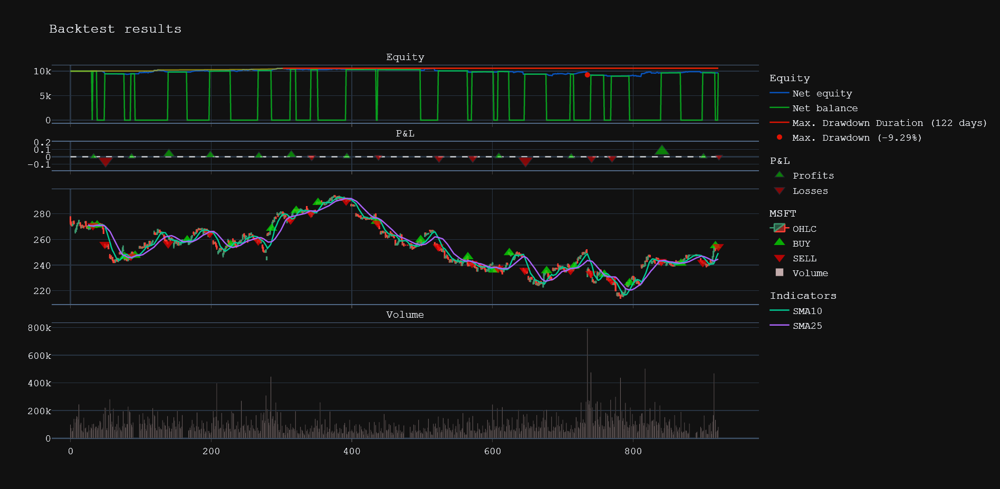

# Mortgage calculator

Backtesting plateform for trading strategy

# Requirements

* **Python 3.7**
* [**numpy**](https://pypi.org/project/numpy/)
* [**pandas**](https://pypi.org/project/pandas/)
* [**requests**](https://pypi.org/project/requests/)
* [**dateutil**](https://pypi.org/project/python-dateutil/)
* [**Tingo API token (free)**](https://api.tiingo.com/)

## Features

* Event-driven backtesting
* Support any timeframe for any financial instrument
* Interactive visualisation
* Detailed financial statistics  

## Usage

```python
import pandas as pd
from backtest_logic.backtester import Backtest


class SMA_Crossover(Backtest):
    def run_sma_strategy(self, SMA1: int, SMA2: int):
        ''' Backtesting an SMA-based strategy.

        Parameters
        ==========
        SMA1, SMA2: int
        shorter and longer term simple moving average (with the given timeframe)
        '''
        msg = f'\n\nRunning SMA crossover strategy | SMA1={SMA1} & SMA2={SMA2}'
        msg += f'\nfixed costs {self.ftc} | '
        msg += f'proportional costs {self.ptc}'
        print(msg)
        print('=' * 55)
        self.position = 0 # initial neutral position
        self.trades = 0 # no trades yet
        self.amount = self.initial_amount # reset initial capital
        self.min_bars = SMA2 # minimum number of bars needed

        symbol = self.symbol[0] #

        data = self.data[symbol]

        plot_SMA1, plot_SMA2 = [], []
        plot_date = []

        #Event loop
        for bar in range(SMA2, data.shape[0]):
            short_ma = data['open'].iloc[bar-SMA1: bar].mean()
            long_ma = data['open'].iloc[bar-SMA2: bar].mean()
            
            plot_SMA1.append(short_ma)
            plot_SMA2.append(long_ma)
            plot_date.append(self.get_date_price(symbol, bar)[0])
            

            if self.position == 0:
                if short_ma >= long_ma:
                    self.place_buy_order(symbol, bar, amount=self.net_wealth)
                    self.position = 1

            if self.position == 1:
                if short_ma < long_ma:
                    self.place_sell_order(symbol, bar, amount=self.net_wealth)
                    self.position = 0

        plot_SMA1 = pd.Series(data=plot_SMA1, index=plot_date, name=f'SMA{SMA1}')
        plot_SMA2 = pd.Series(data=plot_SMA2, index=plot_date, name=f'SMA{SMA2}')
        self.add_plot(plot_SMA1, plot_SMA2)
        

        self.close_out(bar) #Close out all positions

bt = SMA_Crossover('msft', '1hour', '2022-06-01', '2022-12-01', amount=10000, ftc=.0017, verbose=False)
bt.run_sma_strategy(10, 25)
print(bt._statistics())
bt.plot()
```

Generating results...

```
Running SMA crossover strategy | SMA1=10 & SMA2=25
fixed costs 0.0021 | proportional costs 0.0
=======================================================
Min. lookback                              25.0hour
Start (- min lookback)    2022-06-06 18:00:00+00:00
End                       2022-12-01 19:00:00+00:00
Duration                          178 days 01:00:00
Initial equity [$]                          10000.0
Final equity [$]                        9639.135802
Total return [%]                          -3.608642
Buy and Hold [%]                          -4.786096
Ann. Return [%]                           -6.498269
Ann. Volatility [%]                       22.504261
Sharpe ratio                              -0.288757
Sortino Ratio                             -0.216093
Calmar Ratio                              -0.699589
Max. Drawdown [%]                         -9.288700
Max. Drawdown date        2022-10-26 14:00:00+00:00
Max. Drawdown Duration            122 days 05:00:00
Max. Drawdown start       2022-08-01 14:00:00+00:00
Max. Drawdown end         2022-12-01 19:00:00+00:00
# Trades                                         20
Win rate [%]                                   55.0
Best Trade [%]                             0.072915
Worst Trade [%]                           -0.055585
Avg. Trade [%]                            -0.001443
Max. Trade Duration                 9 days 21:00:00
Min. Trade Duration                 0 days 01:00:00
Avg. Trade Duration                 4 days 05:36:00
Strategy                              SMA_Crossover
```




